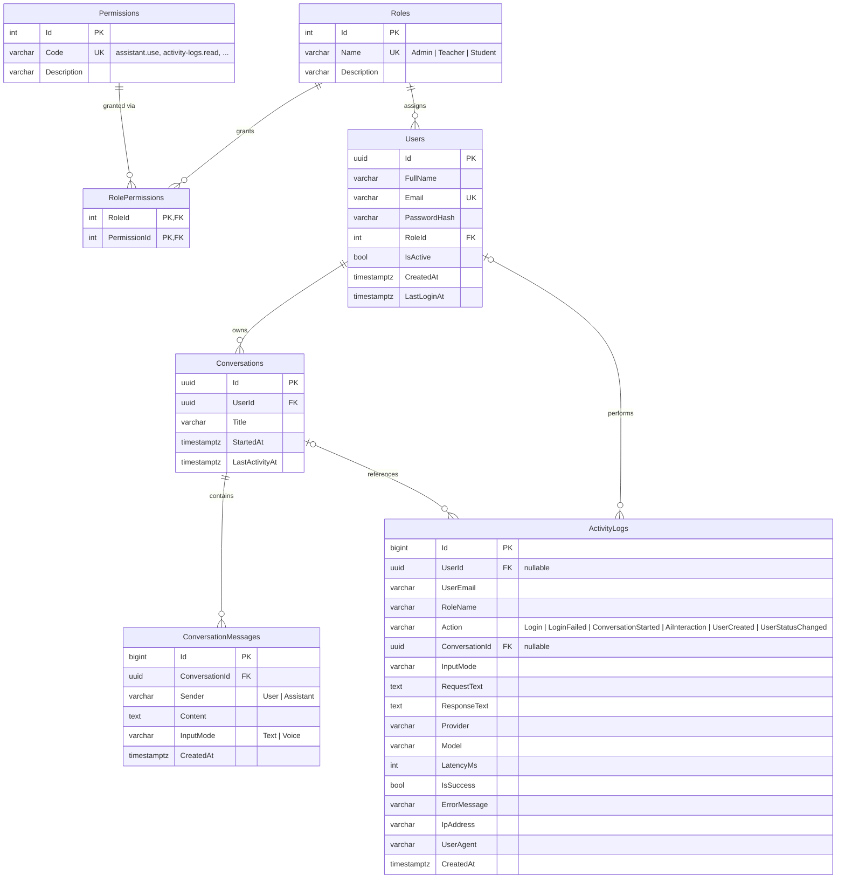

# MinuteHire Voice Assistant — ER Diagram

| Role | Permissions |
|---|---|
| Admin | dashboard.view, activity-logs.read, conversations.read-all, users.manage |
| Teacher | assistant.use |
| Student | assistant.use |
